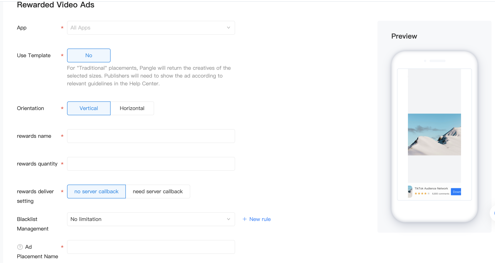

# Rewarded Video
## Introduction
Rewarded video is a full-screen video ad. Users can get rewards after watching the video. At present, the forms of Pangle rewarded video ads:
1. Display a Endcard after the video
2. Display a playable ad after the video
3. Directly display a playable ad.

## Precondition
1. Create an app and reward video ad placement on Pangle platform

  - Create an application: 【Traffic Management]- [Application Management]-[New Application]
    - Reference：[How do I create a new App?](https://www.pangleglobal.com/jp/help/doc/5dd362e23d7897001168e334)

  - Create an ad placement：【Traffic Management】-【Placement Management】-【New Placement】-【Rewarded Video AD】
    - Reference：[How do I create an ad placement?](https://www.pangleglobal.com/jp/help/doc/5e62079cfe8738000fd184cf)
      - Create a Rewarded Video ad placement


​
### Parameter Setting：
- `Orienation`: Select the orientation of the video.
- `Reward amount`: Enter the number of reward items the user will receive. Must be a whole number.
- `Reward item`: Enter the name of reward item the user will receive. Examples: Coins, extra lives
- `Reward deliver setting`：Validate each completed rewarded video ad view and ensure you're only rewarding users who have actually finished watching the video in your app.

### Server callback
The server-side verification callback will append query parameters to your postback url describing the rewarded video interaction:

`user_id=%s&trans_id=%s&reward_name=%s&reward_amount=%d&extra=%s&sign=%s`

| Field Name    | Field Definition               | Field Type | Remarks                                                                 |
|---------------|--------------------------------|------------|-------------------------------------------------------------------------|
| sign          | signSignature of   the request | string     | Signature of the   request guarantees security                          |
| user_id       | User id                        | string     | App's unique   user identifier, it depends on what you entered via SDK. |
| trans_id      | Transaction id                 | string     | Unique   transaction ID for completing viewing the ad                   |
| reward_amount | number of   rewards            | int        | Pangle platform   configuration                                         |
| reward_name   | Name of rewards                | string     | Pangle platform   configuration                                         |
| extra         | Extra                          | string     | Call SDK input   and pass-through，leave it   empty if not needed.      |

### Signature Generation：
- `appSecurityKey`: The key you get for adding rewarded video ad code bit on the Pangle Network
- `transId`: transaction id
- `sign`: sha256(appSecurityKey:transId)

Python sample:
```python
import hashlib
if __name__ == "__main__":
    trans_id = "6FEB23ACB0374985A2A52D282EDD5361u6643"
    app_security_key = "7ca31ab0a59d69a42dd8abc7cf2d8fbd"
    check_sign_raw = "%s:%s" % (app_security_key, trans_id)
    sign = hashlib.sha256(check_sign_raw).hexdigest()

```

### Return：
Returns json data with the following fields:

| Field Definition | Field Name        | Field Type | Remarks                                        |
|------------------|-------------------|------------|------------------------------------------------|
| isValid          | Validation result | BOOL       | determines the result, whether to award or not |

#### Instance
```json
{
   "isValid": true
}
```

**Note：**

The Server-side verification is not necessary. Server-side verification acts as an additional layer of validation for rewarded ad views in your app. It’s performed in addition to the standard client-side callback. You can use server-side verification to validate each completed rewarded video ad view and ensure you're only rewarding users who have actually finished watching the video in your app.

## RewardedVideo Implementation

### Create RewardedVideo Object and Request Ads

#### BURewardedVideoAd
Rewarded ads are requested and shown by BURewardedVideoAd objects. The first step is initialize an object and set its ad placement ID.

Requied：

| Field Definition | Field Name | Field Type | Remarks     |
|------------------|------------|------------|-------------|
| SlotID           | slot  ID   | NSString   | ad space ID |

Optional：

| Field Definition | Field Name             | Field Type | Remarks                                                            |
|------------------|------------------------|------------|--------------------------------------------------------------------|
| userId           | unique user identifier | NSString   | Call SDK pass-through，app's unique user identifier.It isn't null. |
| extra            | Extra                  | NSString   | Expected json serialized string                                    |


To load a rewarded ad, call `loadAdData` on the `BURewardedVideoAd` object

##### Instance:

```objective-c
//It is required to generate a new BURewardedVideoAd object each time calling the loadAdData method to request the latest rewarded video ad. Please do not reuse the local cache rewarded video ad.
BURewardedVideoModel *model = [[BURewardedVideoModel alloc] init];
model.userId = @"123";
self.rewardedVideoAd = [[BURewardedVideoAd alloc] initWithSlotID:slotID rewardedVideoModel:model];
self.rewardedVideoAd.delegate = self;
[self.rewardedVideoAd loadAdData];
```


###  BURewardedVideoAdDelegate  Callback

| rewardedVideoAdDidLoad:                           | This method is called when video ad material loaded successfully.                                                                                                                                    |
|---------------------------------------------------|------------------------------------------------------------------------------------------------------------------------------------------------------------------------------------------------------|
| rewardedVideoAd: didFailWithError:                | This method is called when video ad material failed to load.                                                                                                                                         |
| rewardedVideoAdVideoDidLoad:                      | This method is called when cached successfully.It is suggested that the display of advertisement in this callback method can ensure the smooth display of advertisement and better user experience.  |
| rewardedVideoAdWillVisible:                       | This method is called when a video ad slot will be showing.                                                                                                                                          |
| rewardedVideoAdDidVisible:                        | This method is called when a video ad slot has been shown.                                                                                                                                           |
| rewardedVideoAdWillClose:                         |  This method is called when a video ad is about to close.                                                                                                                                            |
| rewardedVideoAdDidClose:                          | This method is called when a video ad is closed.                                                                                                                                                     |
| rewardedVideoAdDidClick:                          | This method is called when a video ad is clicked.                                                                                                                                                    |
| rewardedVideoAdDidPlayFinish:didFailWithError:    | This method is called when video ad play is completed or an error occurs.                                                                                                                            |
| rewardedVideoAdServerRewardDidSucceed: verify:    | Server verification which is requested asynchronously is succeeded.verify :return YES when the return value is 2000.                                                                                 |
| rewardedVideoAdServerRewardDidFail:               | Server verification, which is requested asynchronously , failed. Return value is not 2000.                                                                                                           |
| rewardedVideoAdServerRewardDidFail: error:        | Server verification, which is requested asynchronously , failed.                                                                                                                                     |
| rewardedVideoAdDidClickSkip:                      | This method is called when the user clicked the skip button.（needs to be applied separately, CPM has negative effect）                                                                              |
| rewardedVideoAdCallback: withType:                | This method is used to get a type of rewarded video Ad.                                                                                                                                              |


**Note:** To have a better user experience, we recommend to show RewardedVideo after `rewardedVideoAdVideoDidLoad` callback is triggered. It means the video has been downloaded successfully.

### Display RewardedVideo
Before displaying a rewarded ad to users, you must present the user with an explicit choice to view rewarded ad content in exchange for a reward. Rewarded ads must always be an opt-in experience.

To show a rewarded ad, check the `rewardedVideoAdDidLoad` callback to verify that if the ad is returned. Then call `showAdFromRootViewController` to show a rewarded ad. The `rootViewController` is needed to pass for this method.

Instance:

```objective-c
- (void)showRewardVideoAd {
  if (self.rewardedVideoAd) {
     [self.rewardedVideoAd showAdFromRootViewController:self];
   }
 }
```


#### Reward video ad showtime
We recommend to check the rewardedVideoAdVideoDidLoad callback before showing a  rewarded ad to verify if the video is finished loading.

```objective-c
- (void)rewardedVideoAdVideoDidLoad:(BURewardedVideoAd *)rewardedVideoAd {
   //After the callback method, the advertisement is displayed, which can ensure the smooth playing and display, and the user experience is better.
}
```

### Reload reward video ad
`BURewardedVideoAd` is a one-time-use object. This means that once a rewarded ad is shown, the object can't be used to load another ad. To request another rewarded ad, you'll need to create a new `BURewardedVideoAd` object.

A best practice is to load another rewarded ad in the `rewardedVideoAdDidClose` method on `BURewardedVideoAdDelegate` so that the next rewarded ad starts loading as soon as the previous one is dismissed:

```objective-c
- (void)rewardedVideoAdDidClose:(BURewardedVideoAd *)rewardedVideoAd {
//The original BURewardedVideoAd object can be set to nil in this callback
}
```

### Note
1. All the rootViewController parameters in Ad APIs must be provided to process ad redirects.In the SDK, all redirects use the present method. Therefore, make sure that the passed rootViewController parameters are not null and do not have other present controllers. Otherwise the present will fail because presentedViewController already exists.
2. Select the server callback, please ensure that the type of userid is NSString and not empty. The callback URL instance
```json
{
    "isValid": true
}
```

3. In order to ensure smooth playback and display, we recommend to check the `rewardedVideoAdVideoDidLoad` callback before showing the ad to verify if the video is finished loading.
4. The extra should be the string serialized by JSON to ensure that it is not null.
5. The `isAdValid` method has been deprecated since V3.3.0.0. Please do not use this field to verify whether the reward video ad is valid.

### Resource
Demo: [GitHub](https://github.com/bytedance/Bytedance-UnionAD/blob/master/Example/BUDemo/BUDemo/App/Example/controller/BUDRewardedVideoAdViewController.m)
