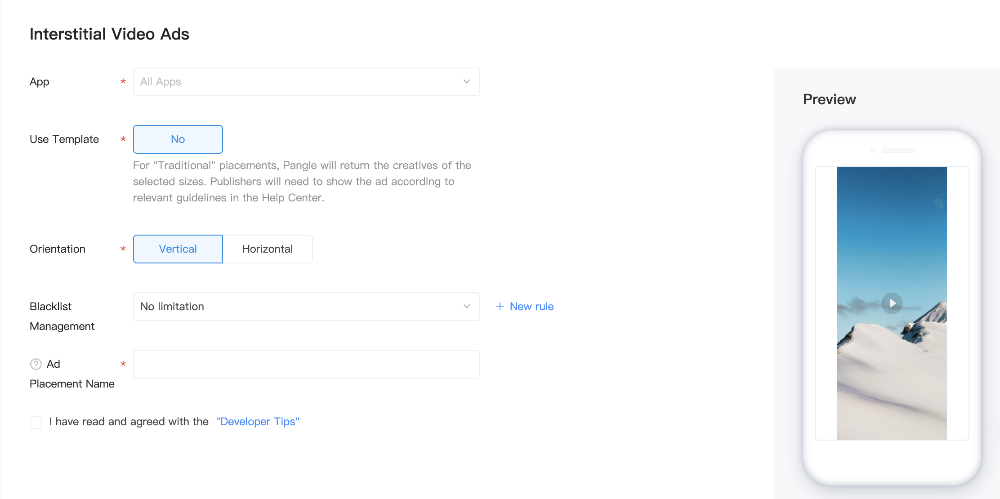

# FullscreenVideo

## Introduction

FullscreenVideo ads are full-screen video ads with 15-30 seconds long that cover the interface of an app until closed by the user. It can be skipped after 5 seconds. They're typically displayed at natural transition points in the flow of an app, such as between activities or during the pause between levels in a game. When an app shows an interstitial ad, the user has the choice to either tap on the ad and continue to its destination or close it and return to the app.

## Precondition
1. Create an app and fullscreen video ad placement on Pangle platform
  - Create an application: 【Traffic Management]- [Application Management]-[New Application]
    - Reference：[How do I create a new App?](https://www.pangleglobal.com/jp/help/doc/5dd362e23d7897001168e334)
  - Create an ad placement：【Traffic Management】-【Placement Management】-【New Placement】-【Full-screen Video AD】
    - Reference：[How do I create an ad placement?](https://www.pangleglobal.com/jp/help/doc/5e62079cfe8738000fd184cf)
      - Create Full-screen Video ad placement


​

### Parameter Setting：
- `Orienation`: Select the orientation of the video.


## FullscreenVideo Implementation

### Create FullscreenVideo Object and Request Ads

#### BUFullscreenVideoAd
FullscreenVideo ads are requested and shown by `BUFullscreenVideoAd` objects. The first step in using one is to instantiate it and set its ad placement Id.

Requied：

| Field Definition | Field Name | Field Type | Remarks     |
|------------------|------------|------------|-------------|
| SlotID           | slot  ID   | NSString   | ad space ID |

To load a fullscreen video ad, call `loadAdData` on the `BUFullscreenVideoAd` object.

Instance:

```objective-c
//It is required to generate a new BUFullscreenVideoAd object each time calling the loadAdData method to request the latest full-screen video ad. Please do not reuse the local cache full-scren video ad.
self.fullscreenVideoAd = [[BUFullscreenVideoAd alloc] initWithSlotID:slotID];
self.fullscreenVideoAd.delegate = self;
[self.fullscreenVideoAd loadAdData];
```

### BUFullscreenVideoAdDelegate Callback

| fullscreenVideoMaterialMetaAdDidLoad:             | This method is called when video ad material loaded successfully.        |
|---------------------------------------------------|--------------------------------------------------------------------------|
| fullscreenVideoAd: didFailWithError:              | This method is called when video ad material failed to load.             |
| fullscreenVideoAdVideoDataDidLoad:                | This method is called when video cached successfully.                    |
| fullscreenVideoAdWillVisible:                     | This method is called when video ad slot will be showing.                |
| fullscreenVideoAdDidVisible:                      | This method is called when video ad slot has been shown.                 |
| fullscreenVideoAdDidClick:                        | This method is called when video ad is clicked.                          |
| fullscreenVideoAdWillClose:                       | This method is called when video ad is about to close.                   |
| fullscreenVideoAdDidClose:                        | This method is called when video ad is closed.                           |
| fullscreenVideoAdDidPlayFinish: didFailWithError: | This method is called when video ad play completed or an error occurred. |
| fullscreenVideoAdDidClickSkip:                    | This method is called when the user clicked skip button.                 |
| fullscreenVideoAdCallback: withType:              | This  method is used to get the type of fullscreen video ad.             |

**Note**: To have a better user experience, we recommend to show `fullscreenVideoAd` after `fullscreenVideoAdVideoDataDidLoad` callback is triggered. It means the video has been downloaded successfully.

### Display Fullscreen Video
Fullscreen video should be displayed during natural pauses in the flow of an app. Between levels of a game is a good example, or after the user completes a task.

To show a Fullscreen video, check the `fullscreenVideoMaterialMetaAdDidLoad` callback to verify that if the ad is returned. Then call `showAdFromRootViewController` to show a Fullscreen video. The `rootViewController` is needed to pass for this method.

Instance:

```objective-c
if (self.fullscreenAd) {
   [self.fullscreenAd showAdFromRootViewController:self];
}
```

#### Full-screen video ad showtime
We recommend to check the `fullscreenVideoAdVideoDataDidLoad` callback before showing a  rewarded ad to verify if the video is finished loading.

Instance:

```objective-c
- (void)fullscreenVideoAdVideoDataDidLoad:(BUFullscreenVideoAd *)fullscreenVideoAd {
//After the callback method, the advertisement is displayed, which can ensure the smooth playing and display, and the user experience is better.
}
```

### Reload fullscreen video ad
`BUFullscreenVideoAd` is a one-time-use object. This means that once a fullscreen video is shown, the object can't be used to load another ad. To request another fullscreen video, you'll need to create a new `BUFullscreenVideoAd` object.

A best practice is to load another fullscreen video in the `fullscreenVideoAdDidClose` method on `BUFullscreenVideoAdDelegate` so that the next fullscreen video starts loading as soon as the previous one is dismissed:

```objective-c
- (void)fullscreenVideoAdDidClose:(BUFullscreenVideoAd *)fullscreenVideoAd {
 //The original BURewardedVideoAd object can be set to nil in this callback
}
```

### Note
1. All the rootViewController parameters in Ad APIs must be provided to process ad redirects. In the SDK, all redirects use the present method. Therefore, make sure that the passed rootViewController parameters are not null and do not have other present controllers. Otherwise the present will fail because presentedViewController already exists.
2. In order to ensure smooth playback and display, we recommend to check the `fullscreenVideoAdVideoDataDidLoad` callback before showing the ad to verify if the video is finished loading.
3. The `isAdValid` method has been deprecated since V3.3.0.0. Please do not use this field to verify whether the fullscreen video ad is valid.

### Resource
Demo: [GitHub](https://github.com/bytedance/Bytedance-UnionAD/blob/master/Example/BUDemo/BUDemo/App/Example/controller/BUDFullscreenViewController.m)
