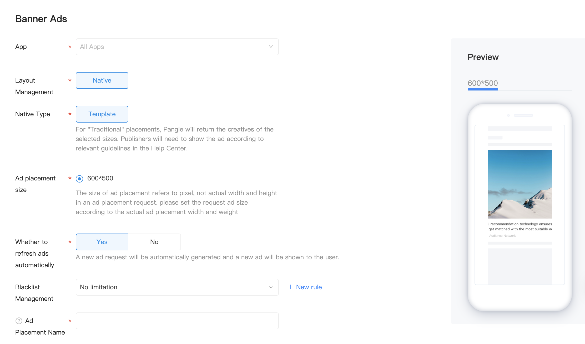

# Banner Ads

## Introduction
Banner ads occupy a spot within an app's layout, either at the top or bottom of the device screen.

## Precondition
1. Create an app and banner ad placement on Pangle platform
  - Create an application: 【Traffic Management]- [Application Management]-[New Application]
    - Reference：[How do I create a new App?](https://www.pangleglobal.com/jp/help/doc/5dd362e23d7897001168e334)
  - Create an ad placement：【Traffic Management】-【Placement Management】-【New Placement】-【Banner AD】
    - Reference：[How do I create an ad placement?](https://www.pangleglobal.com/jp/help/doc/5e62079cfe8738000fd184cf)
      - Create Banner ad placement

      

## Banner Implementation

### Create Banner Object and Request Ads

#### BUNativeExpressBannerView
Banner ads are requested by `BUNativeExpressBannerView` object. The first step in using one is to instantiate it and set its ad placement Id. Then call `loadAdData` on `BUNativeExpressBannerView` to load a banner ad and call `addSubview` to add banner view into your app layout.

Requied：

| Field Definition | Field Name | Field Type | Remarks                                                            |
|------------------|------------|------------|--------------------------------------------------------------------|
| slotID           | slot  ID   | NSString   | ad space ID                                                        |
| adSize           | ad size    | CGSize     | Ad size must be the same size as the pangle platform configuration |

Create a `BUNativeExpressBannerView` object, and call `loadAdData` on `BUNativeExpressBannerView` to load a banner ad.

```objective-c
self.bannerView = [[BUNativeExpressBannerView alloc] initWithSlotID:slotID rootViewController:self adSize:CGSizeMake(screenWidth, bannerHeigh) IsSupportDeepLink:YES];
self.bannerView.frame = CGRectMake(0, self.view.height-bannerHeigh, screenWidth, bannerHeigh);
self.bannerView.delegate = self;
[self.bannerView loadAdData];
```

Optional：

| Field Definition | Field Name        | Field Type | Remarks                                                              |
|------------------|-------------------|------------|----------------------------------------------------------------------|
| interval         | Rotation interval | NSInteger  | The interval of rotation was 30s to 120s, and the shortest was 2.5s. |

### BUNativeExpressBannerViewDelegate Callback

| nativeExpressBannerAdViewDidLoad:                                   | This method is called when bannerAdView ad slot loaded successfully.                                                                                                                                                                                          |
|---------------------------------------------------------------------|---------------------------------------------------------------------------------------------------------------------------------------------------------------------------------------------------------------------------------------------------------------|
| nativeExpressBannerAdView: didLoadFailWithError:                    | This method is called when bannerAdView ad slot failed to load.                                                                                                                                                                                               |
| nativeExpressBannerAdViewRenderSuccess:                             | This method is called when rendering a nativeExpressAdView successed.                                                                                                                                                                                         |
| nativeExpressBannerAdViewRenderFail:error:                          | This method is called when a nativeExpressAdView failed to render.If the rendering fails due to network or hardware reasons, you can change the phone or the network environment. It is recommended to upgrade to the latest version of the Pangle platform.  |
| nativeExpressBannerAdViewWillBecomVisible:                          | This method is called when bannerAdView ad slot shows new ad.                                                                                                                                                                                                 |
| nativeExpressBannerAdViewDidClick:                                  | This method is called when bannerAdView is clicked.                                                                                                                                                                                                           |
| nativeExpressBannerAdView:dislikeWithReason:                        | This method is called when the user clicked dislike button and chose dislike reasons.                                                                                                                                                                         |
| nativeExpressBannerAdViewDidCloseOtherController: interactionType:  | This method is called when another controller has been closed.  interactionType : open appstore in app or open the webpage or view video ad details page.                                                                                                     |

### Display Banner
To show a banner ad, check the `nativeExpressBannerAdViewDidLoad` callback to verify that if the ad is returned. Then check the `nativeExpressBannerAdViewRenderSuccess` to verify if the banner view is rendered successfully. Then a`ddSubview` to display the banner ad.

Instance:
```objective-c
- (void)showBanner {
    [self.view addSubview:self.bannerView];
}
```

#### Banner showtime
Banner ad could only be displayed after receiving `nativeExpressBannerAdViewRenderSuccess`

```objective-c
- (void)nativeExpressBannerAdViewRenderSuccess:(BUNativeExpressBannerView *)bannerAdView {
 //After the callback method, the advertisement is displayed, which can ensure the smooth playing and display, and the user experience is better.
}
```

### Note
1. At present, banner ads support the center display of the bottom or top of the content, and developers can adjust the left and right margins by themselves.

### Resource
Demo: [GitHub](https://github.com/bytedance/Bytedance-UnionAD/blob/master/Example/BUDemo/App/Example/controller/BUDExpressBannerViewController.m)
