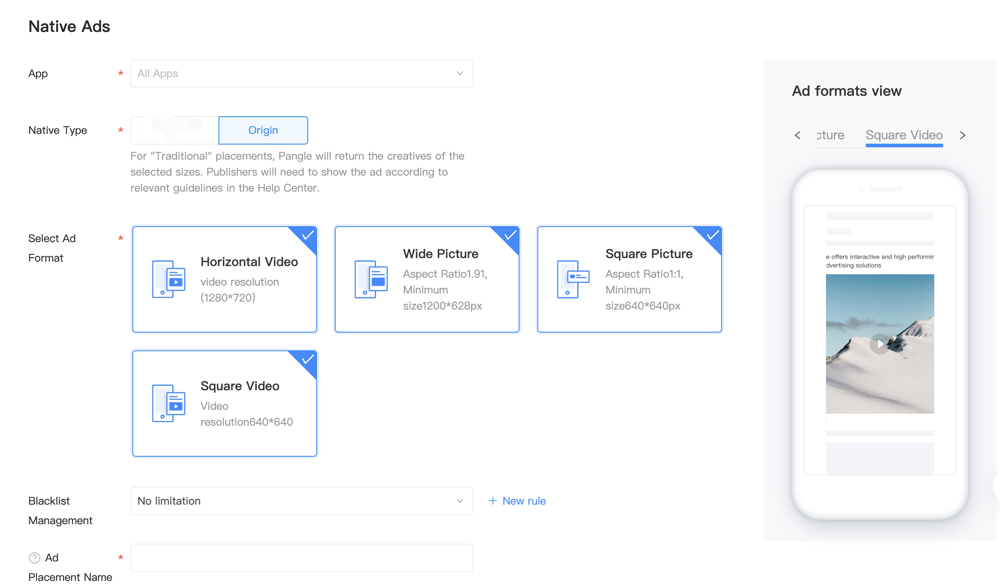

# Native Ads

## Introduction
Native ads are ad assets that are presented to users via UI components that are native to the platform. It can be formatted to match your app's visual design. When a native ad loads, your app receives an ad object that contains its assets, and the app (rather than the SDK) is then responsible for displaying them. This differs from other ad formats, which don't allow you to customize the appearance of the ad.

## Precondition
1. Create an app and native ad placement on Pangle platform
  - Create an application: 【Traffic Management]- [Application Management]-[New Application]
    - Reference：[How do I create a new App?](https://www.pangleglobal.com/jp/help/doc/5dd362e23d7897001168e334)
  - Create an ad placement：【Traffic Management】-【Placement Management】-【New Placement】-【Native Ads】
    - Reference：[How do I create an ad placement?](https://www.pangleglobal.com/jp/help/doc/5e62079cfe8738000fd184cf)
      - Create Native ad placement

      

​
## Native Ads

### Create Native Object and Request Ads

#### BUNativeAdsManager
Native Ads are requested on `BUNativeAdsManager` object. Call `loadAdDataWithCount` on `BUNativeAdsManager` to load Native ads.

Requied:

| Field Definition | Field Name | Field Type | Remarks                 |
|------------------|------------|------------|-------------------------|
| BUAdSlot         |      /     |      /     | The basic configuration |
| slotID           |   slot ID  |            | ad space ID             |

Create `BUAdSlot` to build the configuration of the ad, then call `loadAdDataWithCount` on `BUNativeAdsManager` to load Native ads.

```objective-c
BUNativeAdsManager *nad = [BUNativeAdsManager new];
BUAdSlot *slot1 = [[BUAdSlot alloc] init];
slot1.ID = self.viewModel.slotID;
slot1.AdType = BUAdSlotAdTypeFeed;
nad.adslot = slot1;
nad.delegate = self;
self.adManager = nad;
[nad loadAdDataWithCount:1];
```

**Note**: loadAdDataWithCount allows you to load multi-ads in an ad request. The maximum allowed is 3.

### BUNativeAdsManagerDelegate Callback

| nativeAdsManagerSuccessToLoad:  nativeAds:  | This method is called when native ad loaded successfully. You can insert data in this method.  |
|---------------------------------------------|------------------------------------------------------------------------------------------------|
| nativeAdsManager: didFailWithError:         | This method is called when native ad loaded failed.                                            |

### BUNativeAdDelegate Callback

| nativeAdDidLoad:                                   | This method is called when native ad material loaded successfully.                                                                                                                                                                                                                                                                                                                                          |
|----------------------------------------------------|-------------------------------------------------------------------------------------------------------------------------------------------------------------------------------------------------------------------------------------------------------------------------------------------------------------------------------------------------------------------------------------------------------------|
| nativeAd:didFailWithError:                         | This method is called when native ad materia failed to load.                                                                                                                                                                                                                                                                                                                                                |
| nativeAdDidBecomeVisible:                          | This method is called when a native ad slot has been shown.                                                                                                                                                                                                                                                                                                                                                 |
| nativeAdDidCloseOtherController: interactionType:  | This method is called when another controller has been closed.  interactionType : open appstore in app or open the webpage or view video ad details page.                                                                                                                                                                                                                                                   |
| nativeAdDidClick:withView:                         | This method is called when a native ad is clicked.                                                                                                                                                                                                                                                                                                                                                          |
| nativeAd:dislikeWithReason:                        |  This method is called when the user clicked dislike reasons.   Only used for dislikeButton in BUNativeAdRelatedView.h                                                                                                                                                                                                                                                                                      |
| registerContainer:withClickableViews:              | Register clickable views in native ads view.  Interaction types can be configured on Pangle Network.  Interaction types include view video ad details page, make a call, send email, download the app, open the webpage using a browser,open the webpage within the app, etc.  containerView : required.  container view of the native ad.  clickableViews : optional.  Array of views that are clickable.  |

### BUNativeAdRelatedView interface

| refreshData:  | Refresh the data every time you get new datas in order to show ad perfectly.  |
|---------------|-------------------------------------------------------------------------------|

#### Display Native Ads：
When a native ad loads, your app will receive a native ad object via the `nativeAdDidLoad` callback. Your app is then responsible for displaying the ad (though it doesn't necessarily have to do so immediately).

Instance:

```objective-c
- (void)nativeAdsManagerSuccessToLoad:(BUNativeAdsManager *)adsManager nativeAds:(NSArray<BUNativeAd *> *_Nullable)nativeAdDataArray {
    //the ad data source is assigned, such as:
    for (BUNativeAd *model in nativeAdDataArray) {
        [self.dataSource insertObject:model atIndex:0];//self.dataSource为数据源
    }
    id model = self.dataSource[0];
    if ([model isKindOfClass:[BUNativeAd class]]) {
        BUNativeAd *nativeAd = (BUNativeAd *)model;
        nativeAd.rootViewController = self;
        nativeAd.delegate = self;
        //ad type judged here
        if (nativeAd.data.imageMode == BUFeedADModeLargeImage) {

        } else if (nativeAd.data.imageMode == BUFeedADModeSquareVideo) {

        }
        //ad interaction type
        BUInteractionType type = nativeAd.data.interactionType;
        /*
         *  Value of nativeAd.data.imageMode
         *   BUFeedADModeLargeImage BUFeedADModeSquareVideo
        */
        if (nativeAd.data.imageMode == BUFeedADModeSquareVideo) {
            //The currently displayed (xxx-> view that is currently displaying the AD) needs to comply with nativeAdRelatedView.videoAdView.delegate
            xxx.nativeAdRelatedView.videoAdView.delegate = self;
            //must to register the registerContainer, otherwise we can't confirm whether the display is an ad
            //(xxx-> view that is currently displaying the AD)
            [nativeAd registerContainer:xxx withClickableViews:@[xxx.creativeButton]];

            self.nativeAdRelatedView.logoImageView.frame = CGRectMake(0,0, logoSize.width, logoSize.height);//Set up according to the requirements of the project

            self.nativeAdRelatedView.adLabel.frame = CGRectMake(0, y + 3, 100, 14);//Set up according to the requirements of the project
            //Pangle logo
            [xxx addSubview:self.nativeAdRelatedView.logoImageView];

            //AD
            [xxx addSubview:self.nativeAdRelatedView.adLabel];
            self.nativeAdRelatedView.dislikeButton.frame = CGRectMake(dislikeX, y, 20, 20);//Set up according to the requirements of the project

            //dislikeButton
            [xxx addSubview:self.nativeAdRelatedView.dislikeButton];
            //refreshData:will be generated automatically videoAdView You need to process the videoadview after the refreshdata:
            [self.nativeAdRelatedView refreshData:model];

            //If you have videoAdView, you can add it
            if (self.nativeAdRelatedView.videoAdView !=nil) {
                self.nativeAdRelatedView.videoAdView.frame = CGRectMake(x, y, contentWidth, imageHeight);//Set up according to the requirements of the project
                [xxx addSubview:self.nativeAdRelatedView.videoAdView];
            }
        }
        //Get material image
        BUImage *image = model.data.imageAry.firstObject;
        //(xxx-> view that is currently displaying the AD)
        xxx.imgIv.frame = CGRectMake(0, 0, imageWidth, imageHeight);//Set up according to the requirements of the project
        //(xxx-> view that is currently displaying the AD)
        [xxx. imgIv setImageWithURL:[NSURL URLWithString:image.imageURL] placeholderImage:nil];

        //Get ad title
        //(xxx-> view that is currently displaying the AD)
        xxx.adTitleLabel.attributedText = model.data.AdTitle;

        //Get buttonText
        //(xxx-> view that is currently displaying the AD)
        [xxx.creativeButton setTitle:self.nativeAd.data.buttonText forState:UIControlStateNormal];

        //Get ad description
        //(xxx-> view that is currently displaying the AD)
        xxx.adDescriptionLabel.text = model.data.AdDescription;
    }
}
```

### Note
1. The ad data source is assigned in nativeAdsManagerSuccessToLoad need to call registerContainer:withClickableViews:clickableViews  click and bind the View,and to call  refreshData: to refresh data.
2. The refreshData: needs to be called after the next native ad is loaded.

### Resource
Demo: [GitHub](https://github.com/bytedance/Bytedance-UnionAD/blob/master/Example/BUDemo/App/Example/controller/BUDFeedViewController.m)
